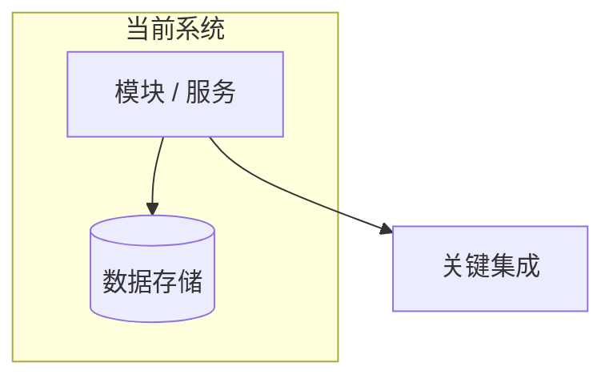

# System Architecture

## 系统边界图

```mermaid
flowchart LR
  user[用户 / 角色]
  system[当前系统]
  external[外部系统]

  user -->|输入 / 请求| system
  system -->|输出 / 调用| external
```

## 系统架构图

```mermaid
flowchart TB
  subgraph system[当前系统]
    module[模块 / 服务]
    datastore[(数据存储)]
    module --> datastore
  end

  integration[关键集成]
  module --> integration
```

## 相关 ADR

- 

## 用户确认记录

<!-- 摘录 System Architecture / ADR 阶段用户逐题确认原文或确认摘要。 -->

## 最近更新

- change-id: <change-id>
