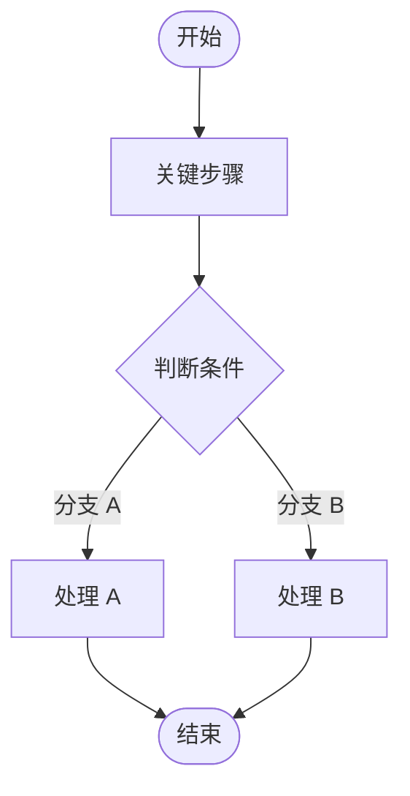
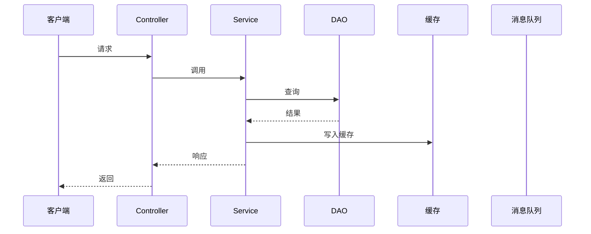
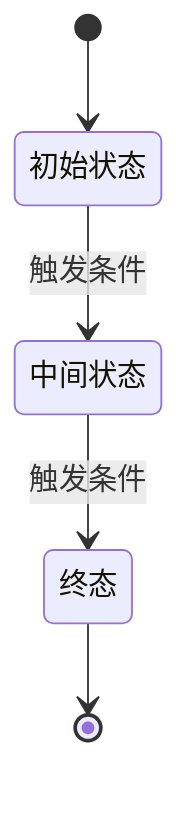
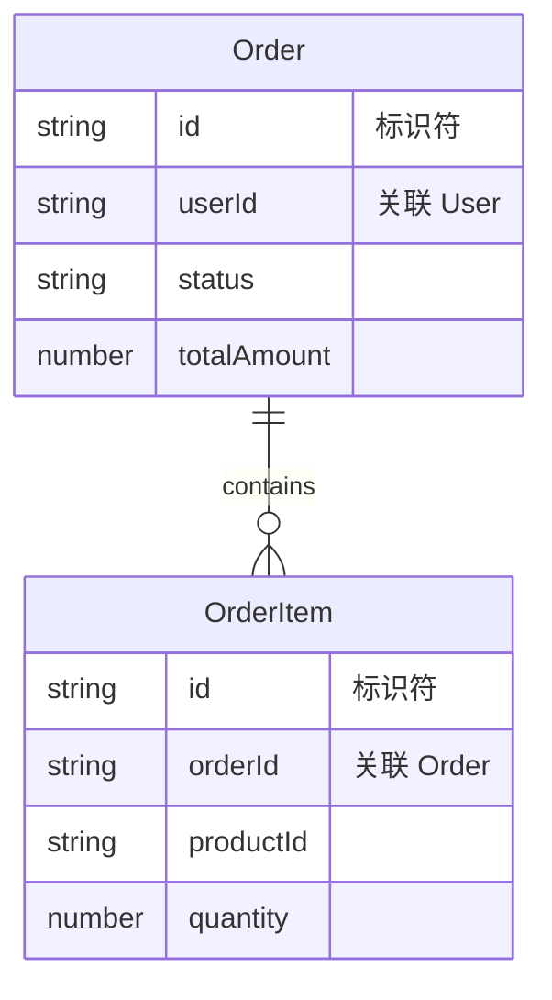

# 功能：<功能名称> 技术实现设计

> 使用前必读：以下各节中的 `<!-- -->` 注释是引导式提示，帮助你覆盖该维度的关键内容。填充时保留章节结构，删除不需要的注释。

## 1. 架构与模块定位

### 模块划分

- 所属模块（已有 / 新建）：
- 模块依赖关系：
- 与已有模块的交互边界：

### 分层职责

| 层级 | 负责的具体逻辑 | 不负责（禁止越权） |
|------|---------------|-------------------|
| Controller / API 层 | | |
| Service / 业务层 | | |
| Repository / DAO / 存储层 | | |
| 第三方适配层 | | |

### 核心设计模式

| 设计模式 | 在该功能中的具体作用 | 为什么选择它 |
|---------|---------------------|-------------|
| | | |

---

## 2. 核心流程 UML

<!-- 所有 UML 必须使用 Mermaid。选择指南：
  - 复杂判断逻辑（多分支/状态机流转）→ flowchart
  - 多组件协作（Controller→Service→DAO→缓存）→ sequenceDiagram
  - 实体超过 3 种状态且有变迁规则 → stateDiagram-v2
  - 角色或场景复杂，需确认覆盖 → flowchart 表达用例关系
  - 流程简单 → 文字 + 表格即可，不画图 -->

### 活动图 / 流程图

<!-- 适用：存在复杂判断逻辑 -->



### 时序图

<!-- 适用：多组件协作。
  ⚠️ 每条生命线必须对应真实组件。禁止把 Controller/Service/DAO 合并为一条"后端"生命线。 -->



### 状态图

<!-- 适用：核心实体状态超过 3 种且有明确变迁规则。
  ⚠️ 必须标注所有合法变迁 + 触发条件 + 非法变迁（如"已完成→草稿"被禁止）。 -->



---

## 3. 数据设计

<!-- ⚠️ 本节是线上故障重灾区，不得跳过或弱化为"沿用现有数据模型"或"本功能无数据变更"。
  必须覆盖：数据模型 + 缓存设计（如适用）+ 消息/事件设计（如适用）。
  数据模型以实体为核心，与存储形式无关——无论数据存于表、文件还是集合，描述的都是同一套实体。 -->

### 3a. 数据模型

<!-- 以下各表均以实体为核心。每个实体的"存储形式"列标注其实际存储方式（表名 / 文件路径 / 集合名），
  其余内容（属性、关系、访问路径、并发、迁移）是存储无关的抽象描述。 -->

<!--
  以下是填充示例——同样是"订单"实体，两种存储形式填入同一套表：

  示例 A：数据库表
  | 实体名 | 描述 | 存储形式 | 存储位置 |
  |--------|------|---------|---------|
  | Order | 订单 | 数据库表 | orders |
  | User  | 用户 | 数据库表 | users |

  示例 B：JSON 文件
  | 实体名 | 描述 | 存储形式 | 存储位置 |
  |--------|------|---------|---------|
  | Order | 订单 | JSON 文件 | data/orders/{date}/{id}.json |
  | User  | 用户 | JSON 文件 | data/users/{id}.json |
-->

#### 实体清单

| 实体名 | 描述 | 存储形式 | 存储位置（表名 / 文件路径 / 集合名） |
|--------|------|---------|-------------------------------------|
| | | | |

#### 属性定义

<!-- 每个实体一张表 -->

**实体 `<name>`**：

| 属性名 | 类型 | 必填 | 默认值 | 约束 | 说明 |
|--------|------|------|--------|------|------|
| | | | | | |

#### 实体关系

| 源实体 | 目标实体 | 关系类型（1:1 / 1:N / N:M） | 实现方式（外键 / 嵌入 / 引用路径） | 说明 |
|--------|---------|---------------------------|-----------------------------------|------|
| | | | | |

#### 访问路径

| 实体 | 查询/读取模式 | 存储层实现（索引 / 目录结构 / 命名规则） | 说明 |
|------|-------------|---------------------------------------|------|
| | | | |

#### 并发控制

| 实体 | 并发冲突场景 | 控制策略（悲观锁 / 乐观锁 / 文件锁） | 冲突处理 |
|------|------------|------------------------------------|---------|
| | | | |

#### 数据迁移

| 版本 | 变更内容 | 迁移方式 | 兼容策略 |
|------|---------|---------|---------|
| | | | |

#### ER 图

<!-- ER 图是存储无关的——实体和关系是逻辑概念。"PK""FK"只表示"标识符""关联字段"，不要求物理主键外键。 -->



### 3b. 缓存设计

<!-- 如本功能不涉及缓存，写「本功能不涉及缓存」并说明理由。不要静默跳过。 -->

| 缓存对象 | Key 格式 | 过期策略 | 过期时间 | 更新/失效时机 |
|---------|---------|---------|---------|-------------|
| | | | | |

- 缓存穿透防范：
- 缓存击穿防范：
- 缓存雪崩防范：

### 3c. 消息 / 事件设计

<!-- 如本功能不涉及异步消息，写「本功能不涉及异步消息」并说明理由。不要静默跳过。 -->

| Topic / Queue | 消息体结构 | 生产者（何时发送） | 消费者（如何处理） | 重试/死信/幂等 |
|--------------|-----------|-------------------|-------------------|---------------|
| | | | | |

---

## 4. 接口设计

### 4a. 对外接口

<!-- ⚠️ 必须包含完整错误码清单和含义，至少覆盖 5 个错误码：参数校验失败、资源不存在、权限不足、服务不可用、未知错误。 -->

| 项目 | 内容 |
|------|------|
| 协议 | REST / RPC / WebSocket |
| 路径 | `POST /api/v1/xxx` |
| 鉴权方式 | Token / 签名 / OAuth |

**Request**：

```json
{
  "field": "type // 说明"
}
```

**Response（成功）**：

```json
{
  "code": 0,
  "data": {},
  "message": "success"
}
```

**Response（失败）**：

```json
{
  "code": 1001,
  "message": "错误描述"
}
```

**错误码清单**：

| 错误码 | HTTP 状态码 | 含义 | 触发条件 | 调用方处理建议 |
|--------|-----------|------|---------|--------------|
| 1001 | 400 | 参数校验失败 | 必填字段缺失 / 格式错误 | 检查请求参数 |
| 1002 | 404 | 资源不存在 | ID 对应的记录不存在 | 提示用户 |
| 1003 | 403 | 权限不足 | 用户无此操作权限 | 引导登录或申请权限 |
| 1004 | 503 | 服务不可用 | 依赖服务超时/宕机 | 稍后重试 |
| 1005 | 500 | 未知错误 | 未预期的运行时异常 | 联系技术支持 |

### 4b. 内部接口

| 方法签名 | 所属层 | 参数 | 返回值 | 异常约定 |
|---------|--------|------|--------|---------|
| | | | | |

### 4c. 第三方接口

<!-- 如不涉及外部服务调用，写「本功能不涉及第三方接口」。 -->

| 依赖服务 | 接口 | 连接超时 | 读取超时 | 重试策略 | 降级策略 | 熔断策略 |
|---------|------|---------|---------|---------|---------|---------|
| | | | | | | |

---

## 5. 关键算法 / 业务规则实现

<!-- "关键规则" = spec-delta 中出现了"根据…计算""按照…规则""当…时则""满足…条件时""如果…那么…"等需要"算"或"判"的表述。
  不确定要不要写？写。宁可多一条伪代码，也不要两个开发者对同一条规则做出两种实现。
  如果确实没有，写"本功能无关键算法 / 业务规则"并引用 spec-delta 原文说明判断依据。 -->

<!-- 每个规则一个独立小节 -->

### 规则 `<规则名称>`

- **来源（需求文本中的原话）**：
- **规则描述**：
- **输入**：
- **输出**：
- **示例**（至少 2 个，包含正常值和边界值）：

| 输入 | 预期输出 | 说明 |
|------|---------|------|
| | | |
| | | |

- **伪代码 / 逻辑表达式**：

```
// 伪代码
```

- **备选方案对比**（如适用）：

| 方案 | 实现方式 | 复杂度 | 性能 | 维护成本 | 选择理由 |
|------|---------|--------|------|---------|---------|
| A | | | | | |
| B | | | | | |

- **推荐方案与理由**：

---

## 6. 异常处理与边界条件

<!-- ⚠️ 本节是线上故障重灾区。必须覆盖异常场景 + 处理策略 + 边界条件 + 幂等性 + 并发冲突。 -->

### 异常场景列表

| 异常场景 | 类型 | 触发条件 | 处理策略 | 是否需要告警 | 日志级别 |
|---------|------|---------|---------|------------|---------|
| 参数校验失败 | 数据非法 | 必填字段缺失 | 拒绝，返回错误码 1001 | 否 | WARN |
| 资源不存在 | 业务异常 | ID 无对应记录 | 拒绝，返回错误码 1002 | 否 | INFO |
| 数据库连接超时 | 依赖失败 | 数据库不可用 | 重试 3 次，仍失败则降级 | 是 | ERROR |
| 缓存不可用 | 依赖失败 | Redis 宕机 | 降级读数据库 | 是 | ERROR |
| 并发冲突 | 并发冲突 | 乐观锁版本号不匹配 | 重试 3 次，仍失败返回错误 | 是 | ERROR |
| 库存不足 | 业务异常 | 扣减后库存 < 0 | 拒绝，返回明确错误 | 否 | WARN |

### 处理策略汇总

| 策略 | 适用场景 | 具体实现 |
|------|---------|---------|
| 重试 | 临时性依赖失败 | 3 次，指数退避，1s-2s-4s |
| 降级 | 非核心依赖不可用 | 返回缓存数据 / 默认值 |
| 拒绝 | 业务规则不满足 | 返回明确错误码 |
| 补偿 | 已执行操作需回滚 | 发送补偿消息 / 调用逆向接口 |

### 边界条件

| 边界条件 | 预期行为 | 验证方式 |
|---------|---------|---------|
| 空列表 | 返回空数组，不报错 | |
| null 参数 | 返回参数校验失败 1001 | |
| 重复提交 | 基于请求 ID 幂等，返回已有结果 | |
| 分页极限值（pageSize=0 / 负数 / 超大） | 限制最大 100，默认 20 | |
| 超长字符串输入 | 校验长度，返回 1001 | |
| 并发写同一资源 | 乐观锁保护，冲突方重试或报错 | |

### 幂等性设计

| 操作 | 是否需要幂等 | 实现机制 |
|------|------------|---------|
| | | |

### 并发冲突处理

| 场景 | 锁策略（乐观/悲观） | 选择理由 | 冲突处理 |
|------|-------------------|---------|---------|
| | | | |

---

## 7. 非功能性设计

### 性能

| 指标 | 目标值 | 说明 |
|------|--------|------|
| 预估 QPS / TPS | | |
| 关键路径 P50 响应时间 | | |
| 关键路径 P99 响应时间 | | |
| 是否需要异步化 | | |
| 是否需要批量处理 | | |

### 安全

| 检查项 | 实现方式 |
|--------|---------|
| 权限校验点（哪些接口需要什么权限） | |
| 敏感数据脱敏（日志/响应中哪些字段需脱敏） | |
| SQL 注入防范 | |
| XSS 防范 | |
| 接口限流（如有） | |

### 监控与日志

| 位置 | 日志内容 | 日志级别 | 说明 |
|------|---------|---------|------|
| | | | |

**业务指标埋点**：

| 指标名称 | 类型（Counter/Gauge/Histogram） | 触发时机 |
|---------|-------------------------------|---------|
| | | |

**链路追踪**：Trace ID 的生成和传递方式。

### 配置

| 配置项 | 默认值 | 说明 | 是否需配置中心 |
|--------|--------|------|--------------|
| | | | |

### 限流 / 降级 / 批处理参数

| 参数 | 值 | 说明 |
|------|-----|------|
| | | |

---

## 8. 测试与可验证性建议

<!-- 至少覆盖：正常场景 2-3 个 + 异常场景 3 个 + 边界场景 2 个 -->

### 正常场景

| 编号 | 场景描述 | 输入 | 预期输出 |
|------|---------|------|---------|
| TC-N1 | | | |
| TC-N2 | | | |

### 异常场景

| 编号 | 场景描述 | 输入 | 预期输出 |
|------|---------|------|---------|
| TC-E1 | | | |
| TC-E2 | | | |
| TC-E3 | | | |

### 边界场景

| 编号 | 场景描述 | 输入 | 预期输出 |
|------|---------|------|---------|
| TC-B1 | | | |
| TC-B2 | | | |

### 测试数据构造

| 场景 | 数据准备方式 | 清理方式 |
|------|------------|---------|
| | | |

### Mock 点

<!-- 精确到具体类和方法，不要写"Mock 数据库"这种粗粒度描述 -->

| Mock 对象 | Mock 方法 | Mock 行为 | 适用场景 |
|-----------|----------|----------|---------|
| | | | |

---

## 9. System Architecture / ADR 影响

architecture_update: <!-- yes | no -->

需要进入 System Architecture / ADR 处理的系统边界图或系统架构图变更：

- （无变更写「无」）

adr_needed: <!-- yes | no -->

需要进入 System Architecture / ADR 处理的 ADR 候选：

- （无 ADR 需求写「无」）

用户自述选项：

---

## 开放问题

- （无开放问题写「无」）
