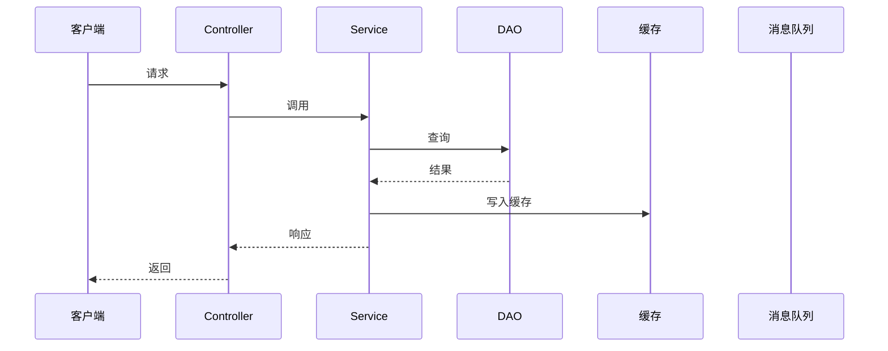
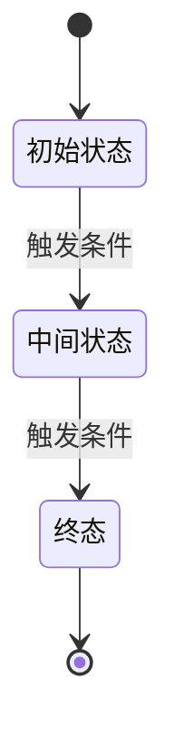
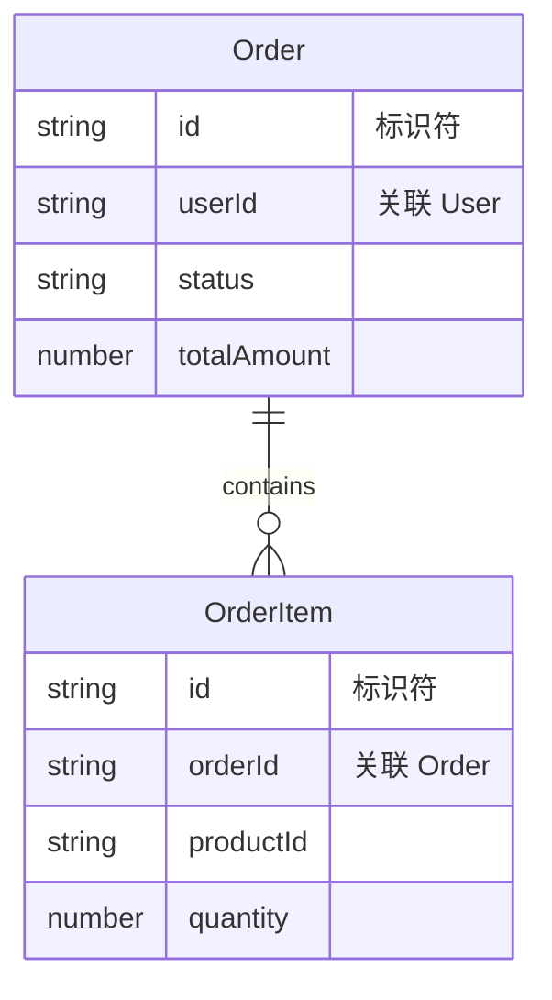
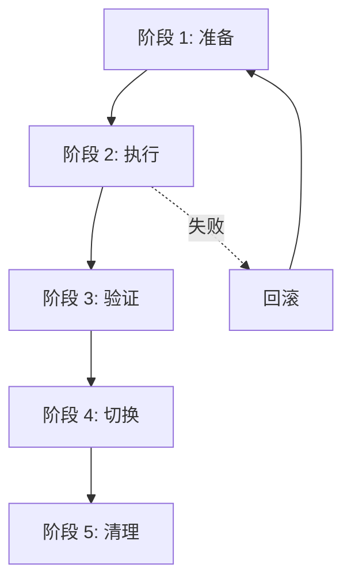

# <变更标题> 技术实现设计

> 使用前必读：
> - 以下各节中的 `<!-- -->` 注释是引导式提示，帮助你覆盖该维度的关键内容。填充时保留章节结构，删除不需要的注释。
> - §0 变更上下文和 §9 架构影响为所有族公共部分，必须保留。
> - 根据 proposal 的变更类型选择对应的族插槽，保留该族插槽内容，删除其他两个族插槽。
> - 功能族（functional）：保留 §1-§8
> - 优化族（nonfunctional）：保留 §1-§5
> - 迁移族（infrastructure）：保留 §1-§6

---

## §0. 变更上下文（公共前置，所有族共享）

### 变更类型

- 变更类型（从 proposal 继承）：functional / nonfunctional / infrastructure
- 选择的族插槽：功能族 / 优化族 / 迁移族

### 上游约束

- 从 architecture.md 提取的约束：
- 从 ADR 提取的约束：

### 影响面摘要

| 维度 | 影响 |
|------|------|
| 模块 | |
| 接口 | |
| 数据 | |
| 配置 | |

---

<!-- ==================== 功能族插槽（§1-§8）==================== -->
<!-- 如果选择功能族，保留以下 §1-§8，删除优化族和迁移族插槽。 -->

## §1. 架构与模块定位

### 模块划分

- 所属模块（已有 / 新建）：
- 模块依赖关系：
- 与已有模块的交互边界：

### 分层职责

| 层级 | 负责的具体逻辑 | 不负责（禁止越权） |
|------|---------------|-------------------|
| Controller / API 层 | | |
| Service / 业务层 | | |
| Repository / DAO / 存储层 | | |
| 第三方适配层 | | |

### 核心设计模式（如适用）

| 设计模式 | 在该功能中的具体作用 | 为什么选择它 |
|---------|---------------------|-------------|
| | | |

<!-- 简单 CRUD 功能可写"本功能无特殊设计模式" -->

---

## §2. 核心流程 UML

<!-- 所有 UML 必须使用 Mermaid。
  先判断是否需要 UML：如果核心流程涉及 ≥2 个组件协作或有分支判断，必须用至少一张图；流程简单时文字 + 表格即可。
  选择指南：
  - 复杂判断逻辑（多分支/状态机流转）→ flowchart
  - ≥2 个组件协作（Controller→Service→DAO→缓存）→ sequenceDiagram
  - 实体有状态变迁且触发条件有业务规则约束 → stateDiagram-v2
  - 角色或场景复杂，需确认覆盖 → flowchart 表达用例关系
  - 流程简单 → 文字 + 表格即可，不画图 -->

### 活动图 / 流程图

<!-- 适用：存在复杂判断逻辑 -->


### 时序图

<!-- 适用：≥2 个组件协作。
  ⚠️ 每条生命线必须对应真实组件。禁止把 Controller/Service/DAO 合并为一条"后端"生命线。 -->



### 状态图

<!-- 适用：核心实体状态有变迁且触发条件有业务规则约束。
  ⚠️ 必须标注所有合法变迁 + 触发条件 + 非法变迁（如"已完成→草稿"被禁止）。 -->



---

## §3. 数据设计

<!-- ⚠️ 本节是线上故障重灾区，不得跳过或弱化为"沿用现有数据模型"或"本功能无数据变更"。
  必须覆盖：数据模型（6 子项均需填写）+ 缓存设计（本功能主动读写缓存时适用）+ 消息/事件设计（本功能主动生产或消费异步消息时适用）。
  数据模型以实体为核心，与存储形式无关——无论数据存于表、文件还是集合，描述的都是同一套实体。 -->

### 3a. 数据模型

<!-- 以下 6 个子项均需填写。如果某子项确实不适用，写"不适用"并说明理由，不能静默跳过。 -->

#### 实体清单

| 实体名 | 描述 | 存储形式 | 存储位置（表名 / 文件路径 / 集合名） |
|--------|------|---------|-------------------------------------|
| | | | |

#### 属性定义

<!-- 每个实体一张表 -->

**实体 `<name>`**：

| 属性名 | 类型 | 必填 | 默认值 | 约束 | 说明 |
|--------|------|------|--------|------|------|
| | | | | | |

#### 实体关系

| 源实体 | 目标实体 | 关系类型（1:1 / 1:N / N:M） | 实现方式（外键 / 嵌入 / 引用路径） | 说明 |
|--------|---------|---------------------------|-----------------------------------|------|
| | | | | |

#### 访问路径

| 实体 | 查询/读取模式 | 存储层实现（索引 / 目录结构 / 命名规则） | 说明 |
|------|-------------|---------------------------------------|------|
| | | | |

#### 并发控制

| 实体 | 并发冲突场景 | 控制策略（悲观锁 / 乐观锁 / 文件锁） | 冲突处理 |
|------|------------|------------------------------------|---------|
| | | | |

#### 数据迁移

| 版本 | 变更内容 | 迁移方式 | 兼容策略 |
|------|---------|---------|---------|
| | | | |

#### ER 图

<!-- ER 图是存储无关的——实体和关系是逻辑概念。"PK""FK"只表示"标识符""关联字段"，不要求物理主键外键。 -->



### 3b. 缓存设计

<!-- 如本功能不主动读写缓存（仅经过已有缓存中间件不算），写「本功能不涉及缓存」并说明理由。不要静默跳过。 -->

| 缓存对象 | Key 格式 | 过期策略 | 过期时间 | 更新/失效时机 |
|---------|---------|---------|---------|-------------|
| | | | | |

- 缓存穿透防范：
- 缓存击穿防范：
- 缓存雪崩防范：

### 3c. 消息 / 事件设计

<!-- 如本功能不涉及异步消息，写「本功能不涉及异步消息」并说明理由。不要静默跳过。 -->

| Topic / Queue | 消息体结构 | 生产者（何时发送） | 消费者（如何处理） | 重试/死信/幂等 |
|--------------|-----------|-------------------|-------------------|---------------|
| | | | | |

---

## §4. 接口设计

### 4a. 对外接口

<!-- ⚠️ 错误码清单必须覆盖该接口所有可预见的失败模式。至少包括：参数校验失败、资源不存在（如适用）、权限不足（如适用）、服务不可用（如适用）、未知错误。
  错误码必须含 HTTP 状态码、含义、触发条件和调用方处理建议。 -->

| 项目 | 内容 |
|------|------|
| 协议 | REST / RPC / WebSocket |
| 路径 | `POST /api/v1/xxx` |
| 鉴权方式 | Token / 签名 / OAuth |
| 接口版本兼容策略（如适用） | |

**Request**：

```json
{
  "field": "type // 说明"
}
```

**Response（成功）**：

```json
{
  "code": 0,
  "data": {},
  "message": "success"
}
```

**Response（失败）**：

```json
{
  "code": 1001,
  "message": "错误描述"
}
```

**错误码清单**：

| 错误码 | HTTP 状态码 | 含义 | 触发条件 | 调用方处理建议 |
|--------|-----------|------|---------|--------------|
| | | | | |

### 4b. 模块间交互契约

| 交互方向 | 数据格式 | 参数 | 返回值 | 异常/错误传播策略 |
|---------|---------|------|--------|----------------|
| | | | | |

### 4c. 第三方接口

<!-- 如不涉及外部服务调用，写「本功能不涉及第三方接口」。 -->

| 依赖服务 | 接口 | 连接超时 | 读取超时 | 重试策略 | 降级策略 | 熔断策略 |
|---------|------|---------|---------|---------|---------|---------|
| | | | | | | |

---

## §5. 关键业务规则与实现逻辑

<!-- "关键规则" = spec-delta 需求使用了带触发条件或条件分支的 EARS 句式（WHEN/WHILE/WHERE/IF ... THEN ... SHALL），即关键规则信号。
  也兼容中文残留表述如"根据…计算""按照…规则""当…时则""满足…条件时""如果…那么…"。
  不确定要不要写？写。宁可多一条伪代码，也不要两个开发者对同一条规则做出两种实现。
  如果确实没有，写"本功能无关键业务规则"并引用 spec-delta 原文说明判断依据。 -->

<!-- 每个规则一个独立小节 -->

### 规则 `<规则名称>`

- **来源（需求文本中的原话）**：
- **规则描述**：
- **输入**：
- **输出**：
- **示例**（至少 2 个，包含正常值和边界值）：

| 输入 | 预期输出 | 说明 |
|------|---------|------|
| | | |
| | | |

- **伪代码 / 逻辑表达式**：

```
// 伪代码
```

- **备选方案对比**（如有多种实现路径）：

| 方案 | 实现方式 | 复杂度 | 性能 | 维护成本 | 选择理由 |
|------|---------|--------|------|---------|---------|
| | | | | | |

- **推荐方案与理由**：

---

## §6. 异常处理与边界条件

<!-- ⚠️ 本节是线上故障重灾区。必须覆盖异常场景 + 处理策略 + 边界条件 + 幂等性 + 并发冲突。
  异常场景列表中的"对应错误码"列必须引用 §4a 中的错误码。 -->

### 异常场景列表

| 异常场景 | 类型 | 触发条件 | 对应错误码（见 §4a） | 处理策略 | 是否需要告警 | 日志级别 |
|---------|------|---------|---------------------|---------|------------|---------|
| 参数校验失败 | 数据非法 | 必填字段缺失 | | 拒绝 | 否 | WARN |
| 资源不存在 | 业务异常 | ID 无对应记录 | | 拒绝 | 否 | INFO |
| 数据库连接超时 | 依赖失败 | 数据库不可用 | | 重试 3 次，仍失败则降级 | 是 | ERROR |
| 缓存不可用 | 依赖失败 | Redis 宕机 | | 降级读数据库 | 是 | ERROR |
| 并发冲突 | 并发冲突 | 乐观锁版本号不匹配 | | 重试 3 次，仍失败返回错误 | 是 | ERROR |
| 业务异常 | 业务异常 | 业务规则不满足 | | 拒绝，返回明确错误 | 否 | WARN |

### 处理策略汇总

| 策略 | 适用场景 | 具体实现 |
|------|---------|---------|
| 重试 | 临时性依赖失败 | 3 次，指数退避，1s-2s-4s |
| 降级 | 非核心依赖不可用 | 返回缓存数据 / 默认值 |
| 拒绝 | 业务规则不满足 | 返回明确错误码 |
| 补偿 | 已执行操作需回滚 | 发送补偿消息 / 调用逆向接口 |

### 边界条件

| 边界条件 | 预期行为 | 验证方式 |
|---------|---------|---------|
| 空列表 | 返回空数组，不报错 | |
| null 参数 | 返回参数校验失败 | |
| 重复提交 | 基于请求 ID 幂等，返回已有结果 | |
| 分页极限值（pageSize=0 / 负数 / 超大） | 限制最大 100，默认 20 | |
| 超长字符串输入 | 校验长度，返回错误 | |
| 并发写同一资源 | 乐观锁保护，冲突方重试或报错 | |

### 幂等性设计

| 操作 | 是否需要幂等 | 实现机制 |
|------|------------|---------|
| | | |

<!-- 不需要幂等的操作（如只读操作）写"不需要"并说明理由。 -->

### 并发冲突处理

| 场景 | 锁策略（乐观/悲观） | 选择理由 | 冲突处理 |
|------|-------------------|---------|---------|
| | | | |

---

## §7. 非功能性设计

### 性能

| 指标 | 目标值 | 说明 |
|------|--------|------|
| 量级预估（10/100/1000/10000+ QPS） | | |
| 关键路径 P50 响应时间 | | |
| 关键路径 P99 响应时间 | | |
| 是否需要异步化 | | |
| 是否需要批量处理 | | |

### 安全

| 检查项 | 实现方式 |
|--------|---------|
| 权限校验点（哪些接口需要什么权限） | |
| 敏感数据脱敏（日志/响应中哪些字段需脱敏） | |
| SQL 注入防范 | |
| XSS 防范 | |
| 接口限流（如有） | |

### 监控与日志

| 位置 | 日志内容 | 日志级别 | 说明 |
|------|---------|---------|------|
| | | | |

**业务指标埋点**：

| 指标名称 | 类型（Counter/Gauge/Histogram） | 触发时机 |
|---------|-------------------------------|---------|
| | | |

**链路追踪**：Trace ID 的生成和传递方式。

### 配置

| 配置项 | 默认值 | 说明 | 是否需配置中心 |
|--------|--------|------|--------------|
| | | | |

### 限流 / 降级 / 批处理参数（如适用）

<!-- 不适用时写"本功能不涉及"。 -->

| 参数 | 值 | 说明 |
|------|-----|------|
| | | |

---

## §8. 测试与可验证性设计

<!-- 至少覆盖：正常场景（覆盖 spec-delta 所有 Gherkin Scenario）+ 异常场景 3 个 + 边界场景 2 个。
  "spec-delta 来源"列引用对应 spec-delta 需求的 Gherkin Scenario 名称。 -->

### 正常场景

| 编号 | 场景描述 | 输入 | 预期输出 | spec-delta 来源 |
|------|---------|------|---------|----------------|
| TC-N1 | | | | |
| TC-N2 | | | | |

### 异常场景

| 编号 | 场景描述 | 输入 | 预期输出 | spec-delta 来源 |
|------|---------|------|---------|----------------|
| TC-E1 | | | | |
| TC-E2 | | | | |
| TC-E3 | | | | |

### 边界场景

| 编号 | 场景描述 | 输入 | 预期输出 | spec-delta 来源 |
|------|---------|------|---------|----------------|
| TC-B1 | | | | |
| TC-B2 | | | | |

### 测试数据构造

| 场景 | 数据准备方式 | 清理方式 |
|------|------------|---------|
| | | |

### Mock 点

<!-- 精确到具体类和方法，不要写"Mock 数据库"这种粗粒度描述 -->

| Mock 对象 | Mock 方法 | Mock 行为 | 适用场景 |
|-----------|----------|----------|---------|
| | | | |

---

<!-- ==================== 优化族插槽（§1-§5）==================== -->
<!-- 如果选择优化族，保留以下 §1-§5，删除功能族和迁移族插槽。 -->

## §1. 优化目标与基线

### 优化目标

- 从 proposal 继承的优化方向（性能 / 安全 / 重构 / 技术债 / 可观测性 / 可靠性）：
- 优化的具体方向和预期效果：

### 当前基线指标

| 优化方向 | 当前指标值 | 测量方法 | 测量条件 |
|---------|-----------|---------|---------|
| | | | |

### 目标指标

| 优化方向 | 目标值 | 达标判据 |
|---------|--------|---------|
| | | |

---

## §2. 优化方案设计

### 方案对比

| 优化方向 | 方案 | 预期提升 | 风险 | 复杂度 | 副作用 |
|---------|------|---------|------|--------|--------|
| | | | | | |

### 推荐方案与理由

- 推荐方案：
- 选择理由（为什么选这个方案而不是其他）：

### 影响面分析

| 维度 | 影响 |
|------|------|
| 模块 | |
| 接口 | |
| 数据结构 | |
| 配置 | |

---

## §3. 实现设计

### 核心改动

- 关键代码结构变更：
- 算法替换 / 架构调整的具体实现方式：

### 数据变更（如适用）

<!-- 不适用时写"本优化不涉及数据变更"。 -->

| 变更类型 | 具体内容 | 说明 |
|---------|---------|------|
| | | |

---

## §4. 风险与回滚

### 优化引入的新风险

| 风险 | 触发条件 | 影响范围 | 防范措施 |
|------|---------|---------|---------|
| | | | |

### 行为回归风险

| 已有行为 | 可能的影响 | 验证方法 |
|---------|-----------|---------|
| | | |

### 回滚方案

- 回滚触发条件：
- 回滚步骤：
- 回滚验证：

---

## §5. 验证策略

### 行为回归测试

- 需要运行的已有测试范围：
- 预期结果：全部通过，无行为变更

### 指标对比测试

| 优化方向 | 基线值（§1b） | 目标值（§1c） | 测量方法 | 达标判据 |
|---------|-------------|-------------|---------|---------|
| | | | | |

### 边界与极端场景

| 场景 | 验证方法 | 预期结果 |
|------|---------|---------|
| 并发 | | |
| 大数据量 | | |
| 资源耗尽 | | |

---

<!-- ==================== 迁移族插槽（§1-§6）==================== -->
<!-- 如果选择迁移族，保留以下 §1-§6，删除功能族和优化族插槽。 -->

## §1. 迁移目标与范围

### 迁移目标

- 从 proposal 继承（升级 / 迁移 / CI / 容器化 / 配置变更）：
- 迁移的具体目标：

### 迁移范围

| 组件 | 当前状态 | 目标状态 | 迁移类型 |
|------|---------|---------|---------|
| | | | |

### 迁移约束

| 约束类型 | 约束内容 | 说明 |
|---------|---------|------|
| 停机时间 | | |
| 兼容性 | | |
| 数据量 | | |
| 时间窗口 | | |

---

## §2. 迁移流程设计

### 迁移阶段

| 阶段 | 操作 | 耗时估计 | 可回滚 | 验证方法 |
|------|------|---------|--------|---------|
| | | | | |

### 迁移流程图



### 切换策略

- 切换方式（蓝绿 / 滚动 / 影子 / 停机）：
- 选择理由：

---

## §3. 数据迁移设计

### 数据转换规则

| 源结构 | 目标结构 | 转换逻辑 | 数据量 |
|--------|---------|---------|--------|
| | | | |

### 数据一致性校验

| 校验项 | 方法 | 工具 | 时机 | 不一致处理 |
|--------|------|------|------|-----------|
| | | | | |

### 数据回滚方案

- 回滚触发条件：
- 回滚步骤：
- 回滚验证：

---

## §4. 兼容性设计

### 新旧版本并存

- 并存方案：
- 并存期间的数据处理：

### 接口兼容性（如适用）

<!-- 不适用时写"本次迁移不涉及接口变更"。 -->

| 接口 | 兼容方式 | 说明 |
|------|---------|------|
| | | |

### 配置兼容性（如适用）

<!-- 不适用时写"本次迁移不涉及配置格式变更"。 -->

| 配置项 | 旧格式 | 新格式 | 兼容方式 |
|--------|--------|--------|---------|
| | | | |

---

## §5. 异常处理与回滚

### 迁移失败场景

| 失败场景 | 触发条件 | 处理策略 | 回滚步骤 |
|---------|---------|---------|---------|
| | | | |

### 回滚计划

| 项目 | 内容 |
|------|------|
| 回滚触发条件 | |
| 回滚步骤 | |
| 回滚时间估计 | |
| 回滚验证 | |

### 部分迁移失败处理

| 场景 | 处理方式 | 说明 |
|------|---------|------|
| 某阶段失败但前面阶段已完成 | | |
| 数据部分迁移成功 | | |
| 新旧版本部分切换 | | |

---

## §6. 验证策略

### 迁移完成验证

| 验证项 | 方法 | 通过标准 |
|--------|------|---------|
| 数据一致性 | | |
| 服务连通性 | | |
| 功能可用性 | | |

### 行为回归测试

- 需要运行的已有测试范围：
- 预期结果：全部通过，行为不变

### 性能基线对比

| 指标 | 迁移前基线 | 迁移后目标 | 测量方法 | 通过标准 |
|------|-----------|-----------|---------|---------|
| | | | | |

---

<!-- ==================== 公共收尾 ==================== -->

## §9. System Architecture / ADR 影响

<!-- 所有族共享，编号固定为 §9。不得因族类型跳过。
  对照分族架构影响检查清单逐项检查：
  - 功能族：新增对外接口/用户角色/外部系统/独立部署模块/技术栈/认证方案
  - 优化族：替换中间件/调整模块边界/改变存储策略/引入可观测性方案/改变数据所有权
  - 迁移族：替换数据库框架运行时/改变部署架构/改变CI基础设施/改变配置管理方式/迁移期间系统边界图暂时性变化
  即使全部为"无"也要显式记录。 -->

需要进入 System Architecture / ADR 处理的系统边界图或系统架构图变更：

- （无变更写「无」）

需要进入 System Architecture / ADR 处理的 ADR 候选：

- （无 ADR 需求写「无」）

用户自述选项：

---

## 开放问题

<!-- 无开放问题写「无」 -->

- 
